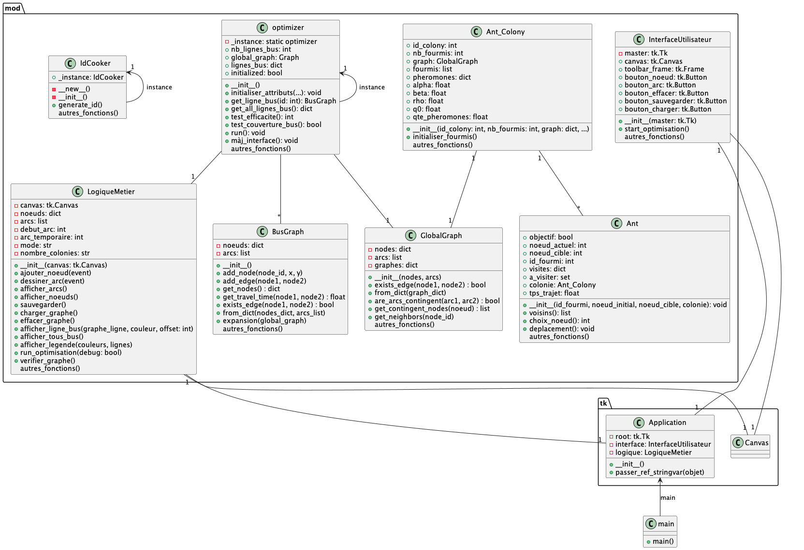

# Projet sur le Bus Allocation Problem (BAP) dans le cadre de l'UE Algorithmes Collaboratifs de Centrale Lyon

Alexandre Louichon & Simon Hergott

Intervenant: Alexandre Saïdi

## Démarrage rapide
```>$ python main.py```

## Compréhension du problème

Le graphe sur lequel on circule est pondéré: à chaque arête, on associe un temps de parcours sur cette arête. Notre problème est le suivant: sachant que l'on a à disposition `k` lignes de bus, comment les agencer pour diminiuer le temps de trajet moyen entre deux points choisis aléatoirement? 
On modélisera le graphe suivant la logique `route = arête`, et `arrêt de bus = noeud`.
Pour cela, on considèrera dans nos hypothèses de fonctionnement que le voyageur peut changer de ligne de bus dès qu'il le souhaite, pourvu qu'il soit à un arrêt ou passe une autre ligne. Il n'y a pas de modélisation du temps d'attente, on considèrera le monde parfait au niveau de la coordination des bus.

Entrée: un graphe, dont les arcs sont des routes et les noeuds sont des arrêts. De plus, on fournit un nombre k de lignes de bus pouvant circuler sur le graphe.

Sortie: Une optimisation du trajet pour chaque ligne de bus, de manière à minimiser le temps de trajet moyen d'un point à l'autre du graphe.

## Approche MACS:

Initialisation :
- Pour un problème avec n arrêts et m lignes de bus, on initialise un MACS avec m ACS.
- Chaque ACS contient r fourmis.

Construction des solutions :
- À chaque itération, chaque fourmi de chaque ACS construit une solution partielle (une ligne de bus).
- Les k-ièmes fourmis de chaque ACS collaborent pour construire une solution globale.
- La solution globale Sk est formée en combinant les solutions partielles de chaque ACS.
- Jk représente la liste des arrêts restant à visiter pour les k-ièmes fourmis.
- Lk et Lgb représentent les temps de parcours moyen.

Mise à jour des phéromones :
- Chaque ACS utilise une règle de mise à jour locale différente et une règle de mise à jour globale différente.
- Les mises à jour locales et globales des phéromones sont effectuées selon les équations 3.3, 3.4, 3.5 et 3.6.
- Cij représente la visibilité d'une arête, qui est l'inverse du temps de parcours entre deux arrêts.

Évaluation des solutions :
- La solution globale Sbg est la meilleure solution trouvée jusqu'à présent.
- Le temps de parcours moyen (att) de chaque solution est calculé.

## Explication globale

Schéma global de l'application, retrouvable dans [le fichier PlantuML associé](projet.puml):




### Interface
L'interface est pilotée par interface.py, instanciée par main.py. On utilise une logique métier dans le back.py pour coordonner les actions: ce fichier gère la logique de l'interface (zone de dessin, boutons etc).

L'interface communique les actions au back, qui les communique à l'optimizer, qui lui même dicte à l'interface comment afficher certains éléments (architecture VMC).

### Optimizer
L'optimizer est le fichier principal faisant la liaison entre le problème d'allocation des bus, la classe des graphes de bus, les colonies de fourmis (acs.py), et les tests.

### Graph & BusGraph

Les classes Graph et busgraph sont des classes dédiées au stockage et à la manipulation des données de graphe : la classe `GlobalGraph()` représente le graphe total (la "ville"), et les `BusGraph()` sont les graphes liés à chaque ligne de bus. Il aurait été possible de changer la structure de données pour stocker directement les graphes dans les colonies de fourmis, mais

